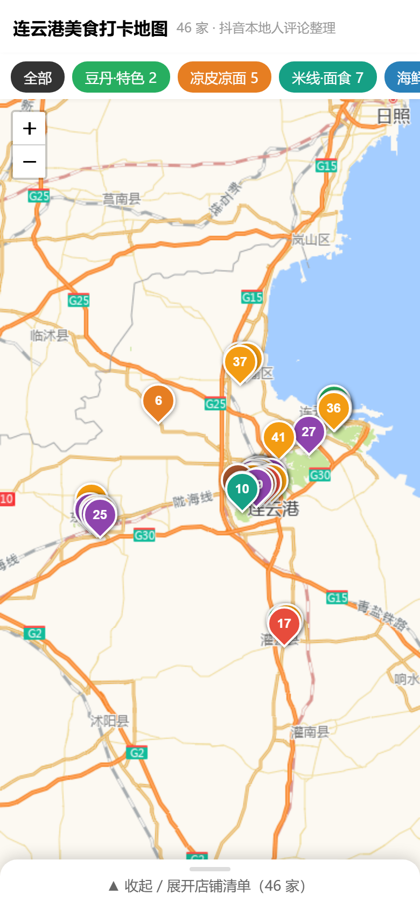
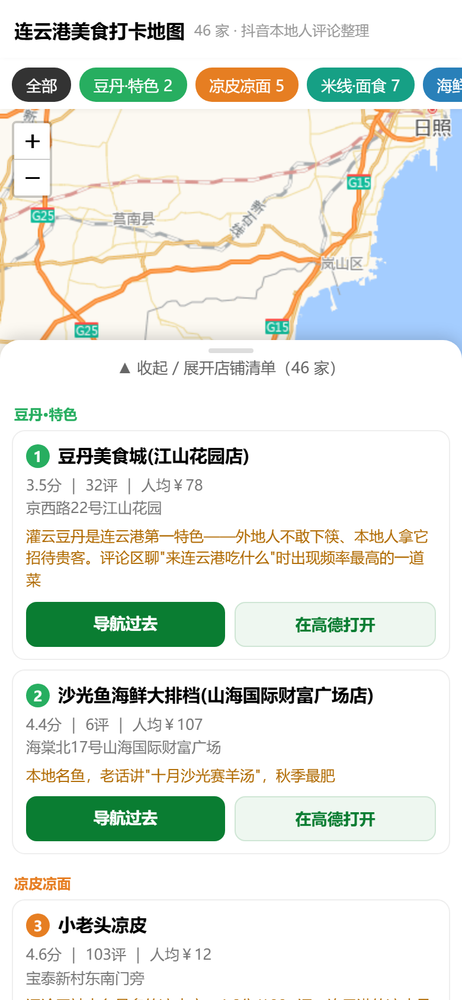
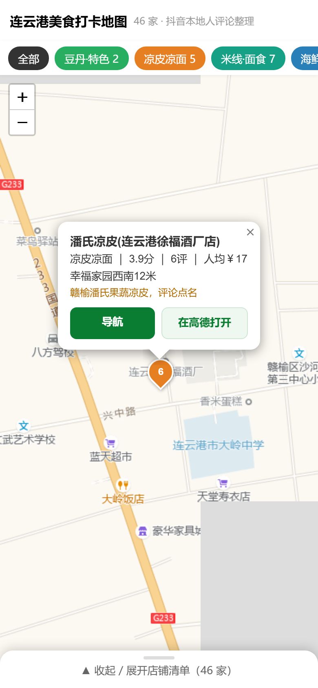
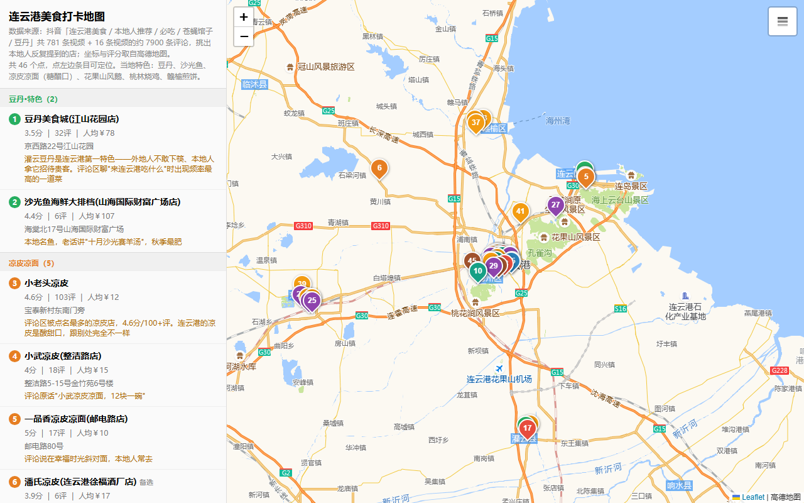

# 城市美食打卡地图 · city-food-map

> 一句话：说「帮我做一份 XX 的美食地图」，自动产出一张**手机上能点、能筛选、能直接导航**的本地人美食地图。
>
> **A skill that turns one sentence into a mobile-first city food map** — Douyin-sourced local picks, Amap geocoding, GitHub Pages hosting, QR poster included.

[](LICENSE)
[](https://github.com/gcy6630/city-food-map-skill)

---

## 🍜 先看效果（点开就是真的地图，不是截图）

| 城市 | 店数 | 在线体验 |
|---|---|---|
| 连云港 | 46 家 · 8 类 | **https://gcy6630.github.io/lianyungang-food-map/** |
| 徐州 | 41 家 | **https://gcy6630.github.io/xuzhou-food-map/** |

手机打开 → 点「全部」旁边的品类筛选 → 点店铺卡片 → 地图自动飞过去、弹出详情 → 点「在高德打开」直接导航。

<p align="center">
  
  
  
</p>
<p align="center">
  
</p>

---

## ✨ 它到底做了什么

不是"把店名钉在地图上"这么简单，它跑的是完整流水线：

1. **抖音挖店** — 抓本地探店视频的内容 + 评论区，从几百条视频里筛出**本地人真的在吃**的店（不是探店广告）。
2. **高德定位** — 官方 Web API 批量查坐标、评分、人均；查不到的会明确标注，不会瞎编一个坐标。
3. **分类分色** — 按品类配色（烧烤/米线/早餐/海鲜/夜市…），生成的筛选按钮和地图图钉颜色一一对应。
4. **手机版地图** — Leaflet + OpenStreetMap 瓦片，零依赖、单文件 HTML，微信里能直接打开。
5. **永久托管** — 自动推到 GitHub Pages，得到一个不会过期的链接 + 可扫码打开的二维码海报。

### 🛡 两道强制闸门（这是它和"随便生成一下"的区别）

| 闸门 | 检查什么 | 为什么需要 |
|---|---|---|
| **city_lint.js** | 城市串味：地图里不许残留上一个城市的名字、坐标、招牌菜；每个分类必须配色；不允许 `background:undefined` 这种半成品 | 复制上一个城市改的时候，最容易漏改一处就发出去了 |
| **verify_mobile.js** | **真的开浏览器点卡片**：断言图钉数=卡片数、瓦片真加载了、点下去地图真飞到位置、弹窗真打开、零 JS 报错 | 静态看 HTML 是看不出"点了没反应"的 |

> 真发生过：闸门抓到过手机版里残留的 `setView([34.75, 117.5], 8)`（上一个城市的坐标）——静态审查根本发现不了。

---

## 🚀 安装

### AionUi 用户（推荐，Windows 一键）

```powershell
# 解压后进入 city-food-map 目录
powershell -ExecutionPolicy Bypass -File .\install.ps1
```

脚本会自动：找 AionUi 技能目录 → 复制 → 调 `aioncore config skills import` 注册 → 打印校验结果。
**装完开一个新对话**，技能才会加载（当前对话不会热更新）。

手动装 / 非 AionUi 用法见 **[INSTALL.md](INSTALL.md)**。

### 依赖

```bash
npm i playwright qrcode jsqr pngjs
npx playwright install chromium
```

### 密钥（可选，但强烈建议）

| 文件（放技能目录或工作目录都行） | 环境变量 | 作用 |
|---|---|---|
| `amap_key.txt` | `AMAP_KEY` | 高德官方 API，46 个关键词 72 秒跑完、不限流 |
| `github_token.txt` | `GITHUB_TOKEN` | 自动部署 GitHub Pages 拿永久链接 |

> 不配也能跑，会退化到网页版抓取（慢，且容易触发高德的临时封禁）。密钥已被 `.gitignore` 排除。

---

## 🗺 做一座新城市

```
帮我做一份 <城市> 的美食地图，要本地人爱去、有当地特色
```

技能会按 [SKILL.md](SKILL.md) 里的流程走，其中 **§3「换城市必查的 4 处」** 是防翻车清单（坐标中心、分类配色、城市名文案、样板数据）。

`reference/` 里放了连云港的完整输入输出（关键词表、出图脚本、速查文案），可以直接抄改。

---

## ⚠️ 老实说的局限

- **高德有 QPS 限流**：官方 API 默认 1400ms 间隔，别调小；重启后短时间连打会 `CUQPS_HAS_EXCEEDED_THE_LIMIT`。
- **网页抓取会被临时封 IP**（419），冷却 25–40 分钟，**跳不过去**——所以能用官方 key 就用 key。
- **抖音结构一改就可能失效**：抓取逻辑是尽力而为，失败时会明确报出来，不会伪造数据。
- **依赖 GitHub Pages**：`*.github.io` 在国内微信内置浏览器实测可打开（这也是选它而不是图床的原因），但访问速度看运营商心情。
- 地图瓦片用 OpenStreetMap 公共服务器，**商用/高流量请换自己的瓦片源**。

---

## 📄 License

MIT —— 随便用、随便改、随便商用，保留版权声明即可。

---

<details>
<summary><b>English</b></summary>

### city-food-map — mobile-first city food map generator (AionUi skill)

Give it one sentence: *"make me a food map for Lianyungang, local favorites only"*.

It then:

1. Mines **Douyin** (TikTok China) food videos + comment sections for places locals actually eat at.
2. Geocodes everything with the **Amap (Gaode)** Web Service API, keeping ratings and per-person cost.
3. Renders a **single-file, mobile-first Leaflet map** with color-coded categories and tap-to-fly-to-pin interaction.
4. Deploys to **GitHub Pages** for a permanent link, plus a scannable QR poster.

Two mandatory quality gates ship with it: a **city-bleed linter** (catches leftovers from the city you copied) and a **real browser interaction test** (actually clicks cards and asserts the map flew to the right pin — static HTML review can't catch a dead click handler).

Live demos: [Lianyungang, 46 spots](https://gcy6630.github.io/lianyungang-food-map/) · [Xuzhou, 41 spots](https://gcy6630.github.io/xuzhou-food-map/)

Install: see [INSTALL.md](INSTALL.md). License: MIT.

</details>
